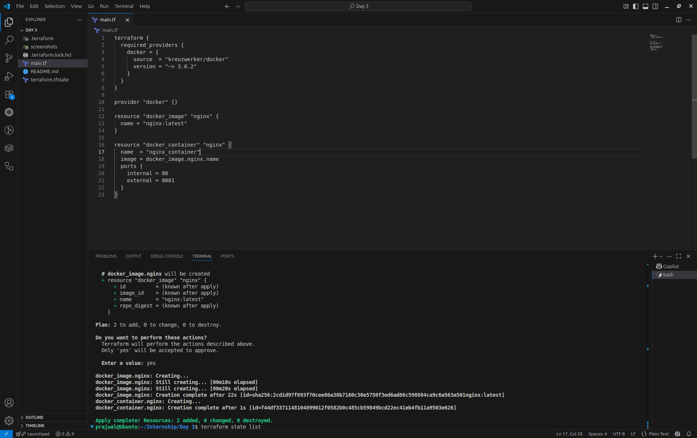
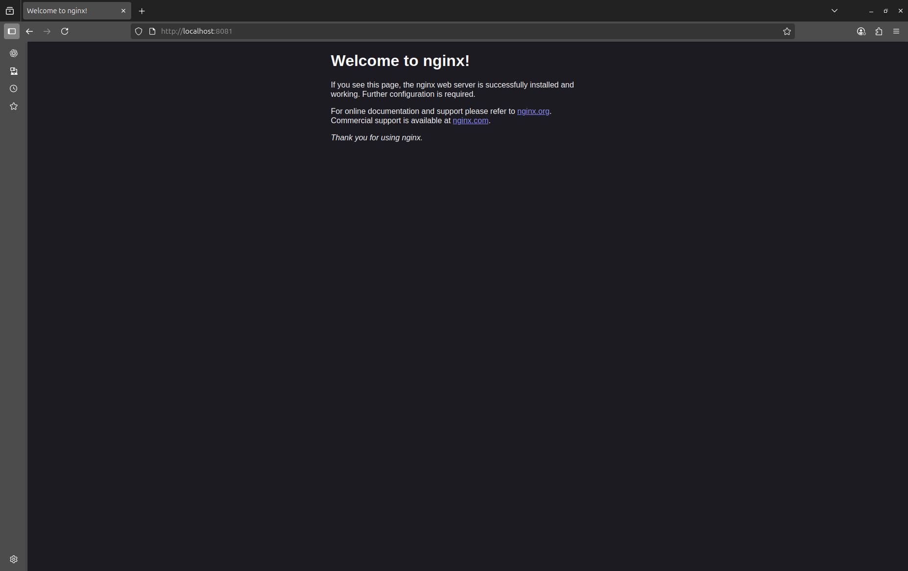
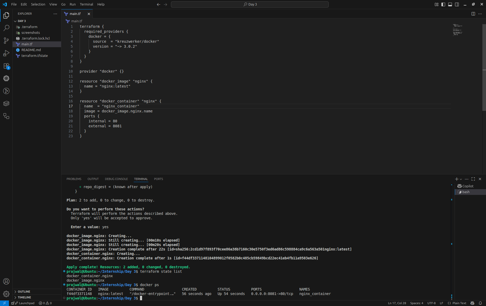

# Terraform Docker Container Provisioning

## Objective
Use Terraform to provision a Docker container running nginx locally.

## Tools
- Terraform
- Docker

## Steps
1. Initialize: `terraform init`
2. Plan: `terraform plan`
3. Apply: `terraform apply`
4. Verify: Visit `http://localhost:8081`
5. Destroy: `terraform destroy`

## Output
- Nginx container runs on port 8081

## Screenshots

### Terminal Output of `terraform apply`
*Add screenshot of the terminal showing the successful terraform apply command output here*



### Browser showing localhost:8081
*Add screenshot of the web browser showing the nginx welcome page at localhost:8081 here*



### Output of `terraform state list`
*Add screenshot of the terminal showing the output of terraform state list command here*



## Commands for Reference

```bash
# Initialize Terraform
terraform init

# Plan the deployment
terraform plan

# Apply the configuration
terraform apply

# List the resources in state
terraform state list

# Destroy the resources when done
terraform destroy
```
